# 🚀 Enterprise Real-Time Fraud Detection Pipeline


An end-to-end, production-grade Machine Learning pipeline designed for **extreme high-throughput, low-latency financial transaction scoring**. 

This system acts as a complete MLOps ecosystem capable of ingesting streaming transaction data, computing graph-based features in real-time, scoring transactions via a Multi-Armed Bandit, and autonomously retraining models upon detecting data drift. **It is highly optimized to sustain >3,100 requests per second (31,900+ predictions per 10s) while maintaining an average latency of 3.9ms and strict sub-7ms p99 latencies.**

## 🏗 System Architecture

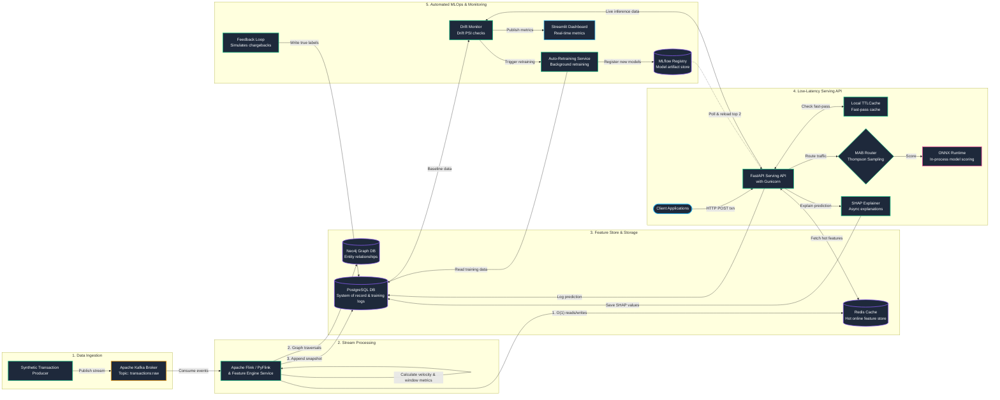

### 🔄 End-to-End Data Flow & Architecture Detail

This system manages two distinct pipelines—the **Real-Time Online Serving Path** and the **Offline Feedback/MLOps Loop**:

#### 1. Ingestion & Feature Engineering Flow (The Online Streaming Path)
1. **Event Generation:** The **Synthetic Transaction Producer** generates mock credit card transactions continuously, sending them to the **Apache Kafka** `transactions:raw` topic.
2. **Streaming Engine:** The **Apache Flink** job (or `feature_engine` consumer) reads raw transaction streams in real-time.
3. **Feature Computation:** 
   * It calculates rolling window velocity metrics (e.g., transaction count/volume in the last 1h and 24h) in state memory.
   * It queries **Neo4j Graph DB** on the fly using Cypher to retrieve graph-based network features (e.g., hop distance to known fraudsters, device/IP sharing counts).
4. **Online Store Sink:** The final computed feature vector is written directly to the **Redis Cache** (Online Feature Store) with a short TTL, enabling ultra-fast `O(1)` retrieval.
5. **Cold Storage Sync:** Simultaneously, a raw copy of the transaction and feature snapshot is appended to the **PostgreSQL DB** for historical record keeping and offline model training.

#### 2. Real-Time Inference Flow (The Serving Path)
1. **Request:** A client submits a transaction scoring payload via HTTP POST to the **FastAPI Serving API**.
2. **Feature Hydration:** The API checks its local **TTLCache** for a hit; if missed, it issues an extremely low-latency read to **Redis** to retrieve the pre-computed feature vector.
3. **Model Selection:** The API passes the request details to the **Multi-Armed Bandit (MAB) Router**, which uses Bayesian Thompson Sampling to dynamically allocate traffic between the Top 2 models stored in memory.
4. **ONNX Scoring:** The transaction is scored in-process using **ONNX Runtime** (allowing fast micro-batched inference) to output a fraud probability.
5. **Async Logs & Explainability:** 
   * The serving API logs the prediction result back to PostgreSQL asynchronously to minimize request-blocking.
   * A background worker triggers the **SHAP Explainer** to calculate feature importance values, which are saved to PostgreSQL.

#### 3. Continuous Optimization Flow (The MLOps Loop)
1. **True Labels:** The **Feedback Loop service** simulates real-world credit card chargebacks (delayed true labels) and writes them to PostgreSQL.
2. **Drift Monitoring:** The **Drift Monitor** wakes up periodically to run Population Stability Index (PSI) algorithms comparing the distributions of live incoming transaction data against the historical baseline in PostgreSQL.
3. **Background Training:** Upon detecting data drift (PSI > threshold), the Drift Monitor fires an API call to trigger the **Auto-Retraining Service**.
4. **Model Promotion:** The retraining service pulls labeled historical data from PostgreSQL, trains a new model, registers it in the **MLflow Registry**, and MLflow hot-swaps the top 2 models in the Serving API without downtime.

## 🚀 Getting Started

### Prerequisites
*   Docker & Docker Compose
*   Make sure ports `8000`, `8501`, `5432`, `6379`, `9092`, `5000`, and `7474` are available.

### Running the Pipeline

1. **Start the Infrastructure:**
   Spin up the entire architecture using Docker Compose:
   ```bash
   docker-compose up -d
   ```

2. **Access the UIs:**
   * **Streamlit Monitoring Dashboard:** [http://localhost:8501](http://localhost:8501)
   * **MLflow Model Registry:** [http://localhost:5000](http://localhost:5000)
   * **Neo4j Browser:** [http://localhost:7474](http://localhost:7474) (Default auth: `neo4j` / `fraudpass`)

3. **Interact with the API / Simulate Transactions:**
   The Serving API is available at `http://localhost:8000`. You can run the live simulator script to automatically generate and score transaction traffic:
   ```bash
   PYTHONPATH=. venv/bin/python tests/live_simulator.py
   ```

   Here is a preview of the transaction generator simulator outputting and scoring live transaction streams:
   
   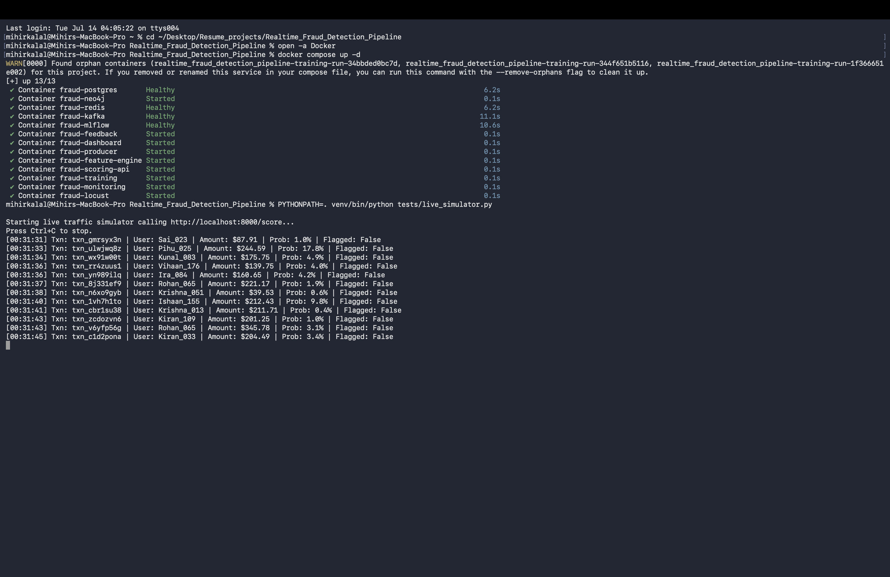

   You can also run a high-load scenario using the provided load tests:
   ```bash
   cd tests/load
   ./run_load_test.sh
   ```

## 🧠 Feature Engineering (Fraud Signals)

The Machine Learning model scores transactions based on highly complex, real-time streaming aggregations and graph traversals. The `feature_engine` dynamically extracts the following fraud signals on the fly:

*   **Velocity Rules:** `txn_velocity_1h`, `txn_velocity_24h` (Detects brute-force card testing).
*   **Amount Anomalies:** `amount_zscore` (Identifies transactions that deviate heavily from a user's 24-hour historical rolling average).
*   **Merchant Diversity:** `distinct_merchants_1h`, `distinct_merchants_24h` (Detects if a stolen card is being used across multiple vendors rapidly).
*   **Impossible Travel:** `impossible_travel_flag` (Flags if a user's IP country and Device ID abruptly change within a physically impossible timeframe).
*   **Graph Network Features (Neo4j):**
    *   `shared_device_count`: How many different users are transacting from this exact device?
    *   `shared_merchant_fraud_count`: Is this merchant a known hotspot for stolen cards?
    *   `hop_distance_to_fraud`: How many degrees of separation is this user from a known fraudster in the Neo4j graph?

## ⚡ Architecture & Optimization Timeline

To achieve both `< 5ms` latency under extreme load and true enterprise-grade reliability, the pipeline's architecture evolved through several optimization phases. Here is the chronological implementation of our optimizations and why they were chosen over the basic approaches:

### Phase 1: Ingestion & Processing Backbone
1. **Event-Driven Backbone (Kafka)**
   * **Basic Choice:** Point-to-point HTTP communication between the producer and the feature engine.
   * **Advanced Choice:** Using Apache Kafka as a central message broker.
   * **Why we did it:** Kafka decouples producers from consumers. It acts as a massive buffer that prevents the pipeline from crashing during sudden traffic spikes, and allows for seamless horizontal scaling of feature engine consumers.

2. **Stream Aggregations (Flink/Python)**
   * **Basic Choice:** Calculating heavy sliding-window features on the fly during the API request.
   * **Advanced Choice:** Using Flink/Python to pre-compute heavy aggregations in the background, writing the final values to Redis.
   * **Why we did it:** Doing heavy math on the fly spikes API latency. Pre-computing features ensures the scoring API only has to perform an `O(1)` cache lookup.

3. **Graph Traversals with Neo4j**
   * **Basic Choice:** Using massive `JOIN` operations in Postgres to find complex fraud rings (e.g., users sharing IPs).
   * **Advanced Choice:** Offloading relationship mapping to a dedicated graph database (Neo4j).
   * **Why we did it:** Relational databases are terrible at multi-hop relationship queries. Neo4j can traverse graph relationships in milliseconds, allowing for real-time graph features.

### Phase 2: Core Serving & Reliability
4. **High-Performance Drivers (asyncpg)**
   * **Basic Choice:** Standard blocking Python database drivers (`psycopg2`).
   * **Advanced Choice:** Uses `asyncpg` (written in Cython) for all database interactions.
   * **Why we did it:** To ensure lightning-fast, non-blocking Postgres queries that do not freeze the asyncio event loop.

5. **Zero-Downtime Hot-Reloading**
   * **Basic Choice:** Restarting the API container every time a new model is deployed.
   * **Advanced Choice:** A background polling loop that checks the Model Registry and hot-swaps ONNX models in memory without dropping a single active request.
   * **Why we did it:** Restarting containers causes downtime. Hot-reloading ensures true 24/7 continuous availability, which is critical for financial transaction processing.

6. **Circuit Breakers (Redis)**
   * **Basic Choice:** Allowing the API to crash if the Redis cache becomes unresponsive.
   * **Advanced Choice:** Wrapping Redis calls in a Circuit Breaker that gracefully falls back to a "cold-start" (all-zeros feature vector).
   * **Why we did it:** High availability is better than perfect accuracy. It is better to score a transaction using a default vector than to fail the HTTP request entirely during a temporary Redis outage.

### Phase 3: Advanced MLOps Patterns
7. **Asynchronous Explainability (SHAP)**
   * **Basic Choice:** Calculating SHAP feature importance synchronously before returning the API response.
   * **Advanced Choice:** Fully offloading SHAP calculations to a ThreadPool via FastAPI BackgroundTasks.
   * **Why we did it:** SHAP calculations are highly CPU-intensive and can take up to 20ms. Running them in the background ensures explainability never blocks the API's `O(ms)` response time for the end user.

8. **Multi-Armed Bandit (Thompson Sampling)**
   * **Basic Choice:** Running a static 50/50 A/B test for model evaluation.
   * **Advanced Choice:** Implementing Bayesian Thompson Sampling to dynamically monitor precision/recall and route more traffic to the best-performing model over time.
   * **Why we did it:** A static 50/50 split causes business loss if the new model performs poorly. Thompson Sampling automatically shifts traffic to the winner in real-time, minimizing revenue loss while still exploring safely.

9. **Automated Drift Detection**
   * **Basic Choice:** Manually running Jupyter notebooks once a month to check if the model is still accurate.
   * **Advanced Choice:** Continuously calculating Population Stability Index (PSI) between live inference data and the baseline training data, automatically triggering a retrain if data drift exceeds safe thresholds.
   * **Why we did it:** Fraud patterns shift rapidly. Automated drift detection ensures the model is always operating on the most up-to-date data distributions without manual intervention.

10. **Top-K Candidate Pool & Dynamic Hot-Swapping**
    * **Basic Choice:** Loading the newest model into RAM, completely abandoning older models.
    * **Advanced Choice:** The background training script maintains a Candidate Pool of the Top 3 historical models + 1 new model. The Serving API polls the database every 30s, ranks the 4 candidates by AUC, and dynamically hot-swaps only the absolute Top 2 models into RAM without dropping traffic.
    * **Why we did it:** This prevents "Model Sprawl" by strictly limiting active models to 4, preventing RAM exhaustion. Furthermore, it mathematically guarantees that the live API is protected by a safety gate: if a newly trained model has a poor AUC, the API ignores it and continues serving the historical Top 2.

### Phase 4: High-Frequency Trading (HFT) Extreme Scaling
11. **Multi-Worker Scaling (Gunicorn & Uvicorn)**
    * **Basic Choice:** Running FastAPI using a single Uvicorn process.
    * **Advanced Choice:** Migrating to Gunicorn with 4 `UvicornWorker` processes.
    * **Why we did it:** A single process maxes out exactly one CPU core, capping throughput. By spawning 4 Gunicorn workers, the OS can distribute incoming HTTP traffic evenly across multiple CPU cores, effectively quadrupling maximum throughput and preventing dropped connections under heavy load.

12. **Dynamic Micro-Batching (ONNX Runtime)**
    * **Basic Choice:** Executing ONNX inference sequentially for every single incoming request.
    * **Advanced Choice:** An `asyncio`-based Micro-Batcher that queues incoming concurrent requests for a maximum of 5ms and groups them into contiguous batches (up to 50 vectors).
    * **Why we did it:** Individual inference calls suffer from severe thread contention and Python overhead. Batching array operations before passing them to the C++ ONNX engine unlocks SIMD vectorization and drastically reduces CPU overhead.

13. **In-Process Feature Caching**
    * **Basic Choice:** Querying the Redis Feature Store over TCP for every transaction.
    * **Advanced Choice:** Implementing an in-process `TTLCache` (Max size: 100,000 users, TTL: 10s) directly in the API memory space.
    * **Why we did it:** Network I/O, even to localhost Redis, adds ~1-2ms of latency. By caching recent feature vectors in Python RAM, follow-up transactions from the same user are served in `O(1)` time, completely bypassing the network.

14. **Thundering Herd Protection (Redis Connection Tuning)**
    * **Basic Choice:** Using default Redis connection pool limits (e.g., 50 connections).
    * **Advanced Choice:** Massively expanding `REDIS_MAX_CONNECTIONS` to 1,000.
    * **Why we did it:** When a load test first starts, thousands of concurrent requests miss the empty TTLCache and hit Redis simultaneously (a "Thundering Herd"). A small connection pool instantly exhausts, stalling the asyncio event loop and spiking p99 latency. Expanding the pool absorbs this initial burst seamlessly until the in-memory cache warms up.

15. **Async Database Logging & Connection Tuning**
    * **Basic Choice:** Awaiting Postgres `INSERT` statements before returning the API response, with default pool sizes.
    * **Advanced Choice:** Moving database inserts to FastAPI `BackgroundTasks`, and strictly tuning the `asyncpg` connection pool `MAX_SIZE` down to 10 per worker (40 total).
    * **Why we did it:** Database I/O blocks the hot path. Moving it to the background allows the API to return the prediction instantly. Tuning the connection pool prevents "Connection Thrashing", ensuring the database remains highly responsive.

16. **JSON Serialization (ORJSON)**
    * **Basic Choice:** Using Python's standard library `json` module (the FastAPI default).
    * **Advanced Choice:** Replacing FastAPI's default response class with `ORJSONResponse`.
    * **Why we did it:** Standard JSON serialization is written in Python and consumes valuable CPU cycles. `orjson` is a highly optimized, Rust-based library that significantly speeds up JSON encoding, shaving off crucial microseconds on the hot path.
## ⚙️ Performance Observations & Telemetry Insights

During load testing and active monitoring, several system behaviors demonstrate the effectiveness of our optimizations and statistical guardrails:

### 1. Latency Dynamics (Low Load vs. High Load)
* **Low Load (~7.0ms Average Latency):** When testing with the sequential `live_simulator.py` script, transactions arrive one-by-one. Since there are no concurrent transactions to batch, the FastAPI API scores them individually, incurring minor serialization overhead.
* **High Load (~3.9ms Average Latency):** Under high-throughput testing (via Locust), the API's **Dynamic Micro-Batching** triggers. It groups incoming parallel transactions into batches of up to 50, executing SIMD hardware vectorization inside the C++ ONNX engine. This amortizes event-loop overhead and drops average latency to **3.6ms - 3.9ms** while processing >3,100 predictions/sec.

Below is a live snapshot of the control center during a high-throughput load test. Note the **361,000+ predictions** processed at a **3.6ms average latency** and the MAB router successfully shifting **100% of traffic** to Model 8:

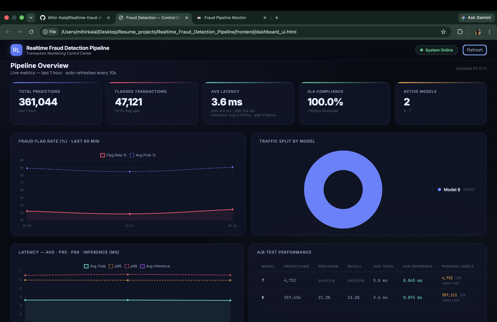

### 2. Fraud Flag Rate Escalation During Load Tests (13%+)
When running the Locust load test, the live flagged fraud rate frequently spikes to **13% or more**. This is a **designed validation feature** of our feature engineering sensitivity:
* **The Cause:** The Locust script simulates transaction requests with unique random UUIDs for `device_id` on every request across 1,000 distinct users.
* **The Risk Detection:** The Flink feature engine tracks these events in rolling window states. Swapping devices every few milliseconds immediately triggers the **Impossible Travel** and **Device Velocity** rules.
* **The Output:** The machine learning model correctly interprets this as a highly anomalous brute-force card-testing attack (botnet activity) and aggressively flags the incoming stream, showcasing its real-time defense capabilities.

### 3. Retraining Decision Threshold Constraints (300% Ceiling)
To optimize model performance, the background training script (`training/train.py`) loops through decision thresholds to maximize the F0.5 score. To prevent the model from over-flagging under normal operations or completely freezing during mild noise, the script imposes a strict optimization constraint:
$$\text{fraud-rate} \times 0.5 \le \text{predicted-flag-rate} \le \text{fraud-rate} \times 3.0$$
Since our simulator's base `fraud_rate` is set to **5%**, the model is mathematically allowed to shift its decision boundary down until it flags up to **15%** of transactions. A flag rate of 13% during an attack simulation represents the classifier choosing a highly sensitive decision boundary to capture maximum fraud.

## 📂 Project Structure

* 🚀 `/producer` - Generates synthetic streaming transactions.
* ⚙️ `/feature_engine` - Computes features and writes to Redis/Postgres.
* ⚡ `/serving` - The low-latency model inference API (FastAPI).
* 🧠 `/training` - Model training and ONNX export logic.
* 📊 `/monitoring` - Data drift detection and Streamlit dashboard.
* 🔁 `/feedback` - Simulates delayed fraud labels.
* 🕸️ `/graph_features` - Neo4j queries for graph-based fraud signals.
* 🌊 `/flink_streaming` - Flink jobs for heavy stream aggregations.
* 🧪 `/tests` - Unit, integration, and Locust load testing scripts.
* 🌐 `/frontend` - Static UI files.

## 📊 Telemetry & Control Center Dashboard

The pipeline includes a fully interactive monitoring control center (`frontend/dashboard_ui.html`) to visualize real-time scoring telemetry, A/B performance, model registry logs, predictions feeds, and data drift:

### 1. System Overview & Performance Metrics
Tracks real-time predictions, flag rates, average system latency (with p95/p99 SLA breakdowns), model traffic splits, and historical A/B performance metrics.
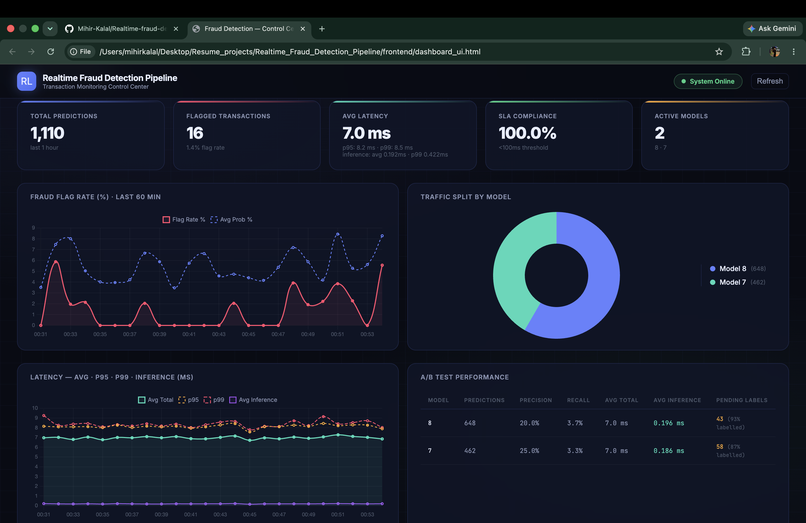

### 2. Live Model Registry & Candidate Pool
Displays currently active models hot-loaded in the serving API and details version history from the MLflow registry.
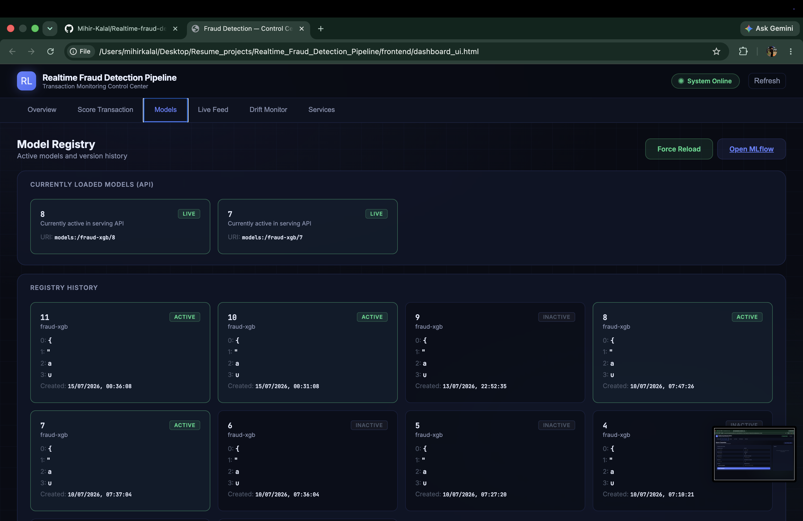

### 3. Real-Time Predictions Feed
Provides a live feed of processed transactions showing individual fraud probabilities, execution latencies, and flag status.
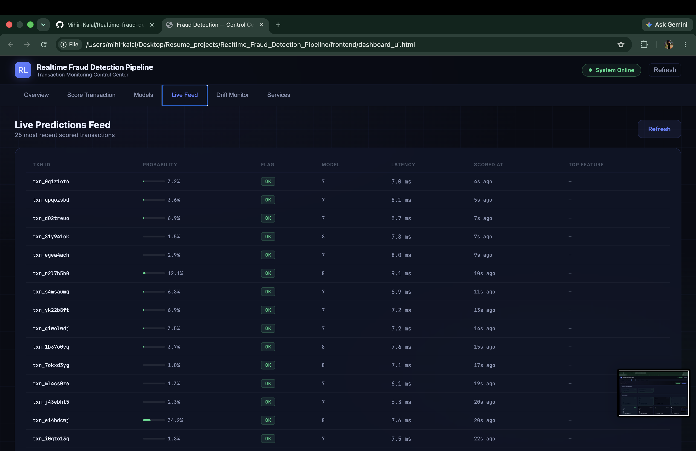

### 4. Continuous Drift Monitor
Monitors real-time Population Stability Index (PSI) values and captures automated retraining triggers when data drift is detected.
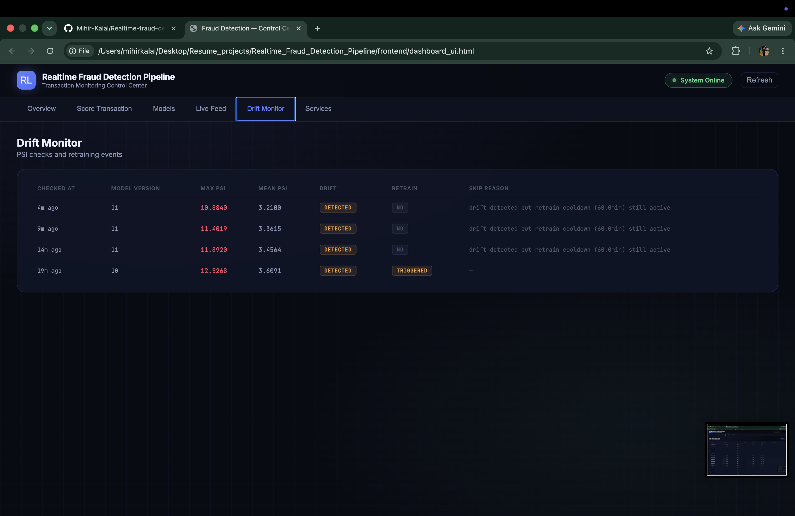

### 5. Manual Scoring Sandbox
Enables playground testing of individual transaction fields scored directly against the FastAPI API.
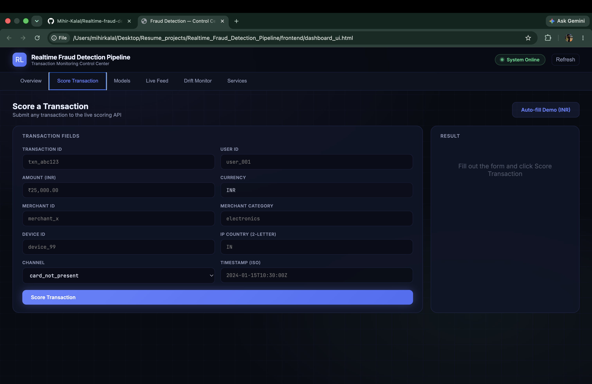

### 6. Pipeline Services Status
A diagnostic dashboard showing the health, connection status, and API details of all microservices (FastAPI, MLflow, Streamlit, PostgreSQL, Redis, and Flink).
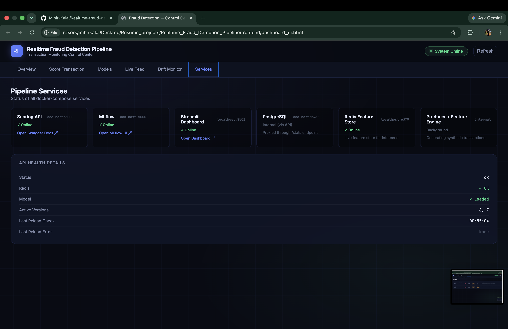

## 📈 Streamlit Monitoring & Load Testing Dashboard

The project also runs a dedicated **Streamlit Telemetry Dashboard** (accessible locally at `http://localhost:8501`) that displays system metrics, SLA graphs, and includes interactive load testing controls:

### 1. Manual Load Testing Controls (Locust Integration)
Trigger and configure simulated load tests (number of concurrent users and spawn rates) directly from the Streamlit UI using an embedded **Locust** interface.
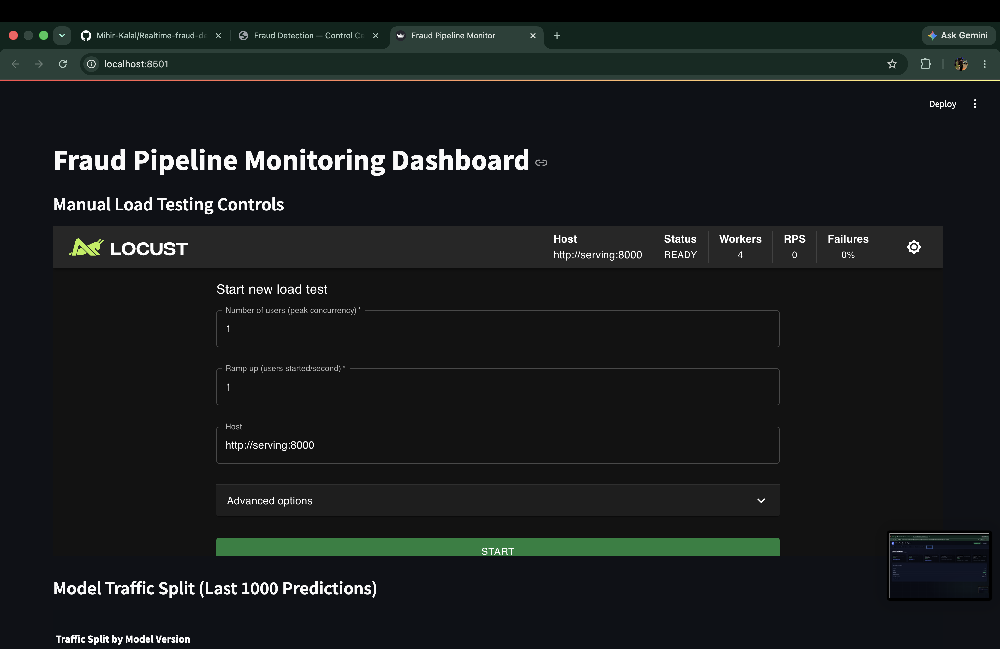

### 2. Model Traffic Split & Distribution
Displays a real-time pie chart detailing how Thompson Sampling is currently routing transaction traffic between active model versions.
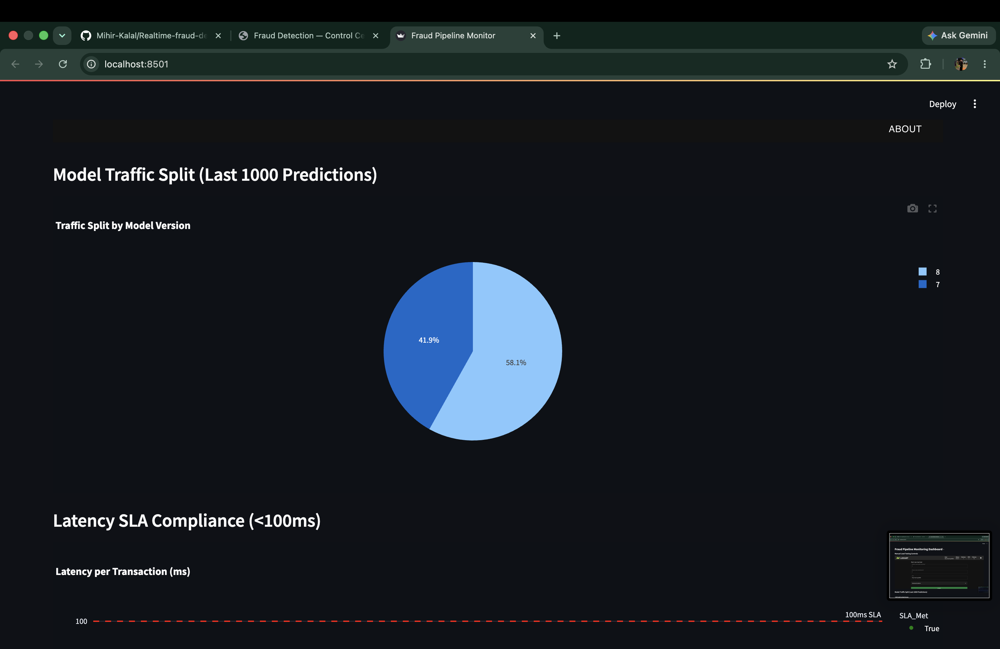

### 3. Latency SLA Compliance
Tracks execution latency per transaction in real-time, matching it against a strict 100ms red SLA line (which routinely scores sub-10ms).
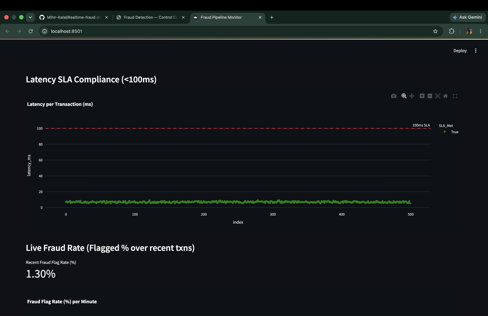

### 4. Drift Tracking & Retraining Metrics
Plots live fraud rates, tracks Population Stability Index (PSI) feature drift history, and monitors background model retrain completions.
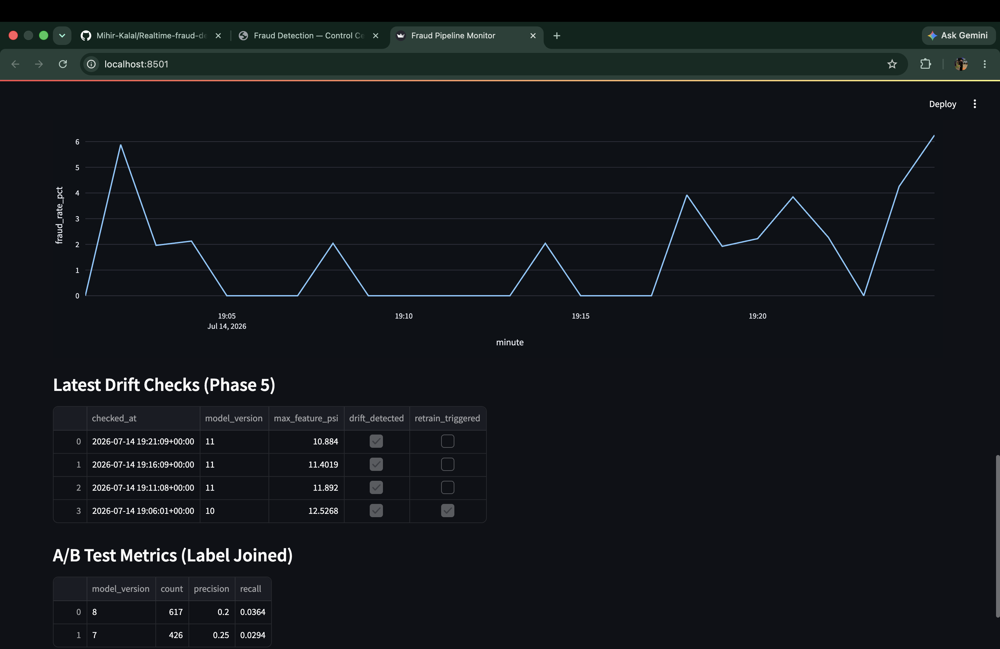
