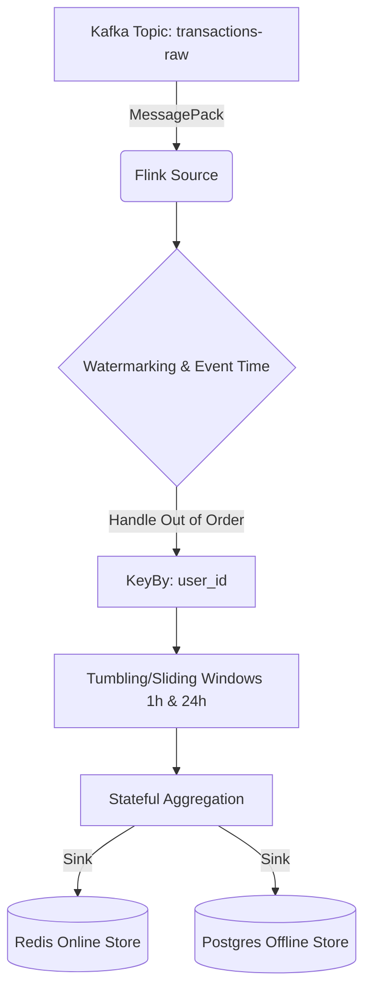

# Apache Flink Streaming Architecture

## Overview
This document outlines the migration of the custom Python-based `feature_engine` consumer to **Apache Flink** (via PyFlink). This architecture is standard in FAANG and HFT environments for scalable, fault-tolerant stream processing.

## Why Flink?
The current `feature_engine` uses a standard Kafka consumer and computes rolling windows using Redis Sorted Sets (`ZADD`, `ZREMRANGEBYSCORE`). This has several limitations at massive scale:
1. **Network IO Bottleneck**: Fetching the entire 24h history from Redis for every transaction is O(N) where N is the user's transaction volume.
2. **Processing Time vs Event Time**: The current implementation uses processing time. If the pipeline lags, events are bucketed incorrectly.
3. **Exactly-Once Semantics**: Standard Python consumers can drop or duplicate events during crashes.

## Flink Architecture Diagram

## Key Flink Advantages Demonstrated
- **Local State Backend**: Flink maintains the 24h transaction history in memory (RocksDB), eliminating the Redis round-trip for feature computation. Redis becomes a true "Sink" (write-only) for serving.
- **Event-Time Processing**: Flink uses the `timestamp` field from the payload and a `WatermarkStrategy` to correctly process events that arrive late or out-of-order.
- **Fault Tolerance**: Flink Checkpoints ensure exactly-once processing semantics.
